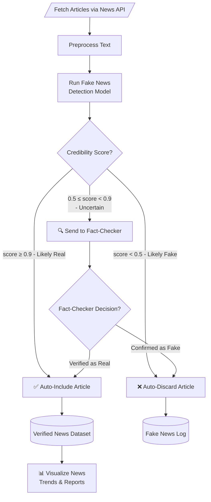
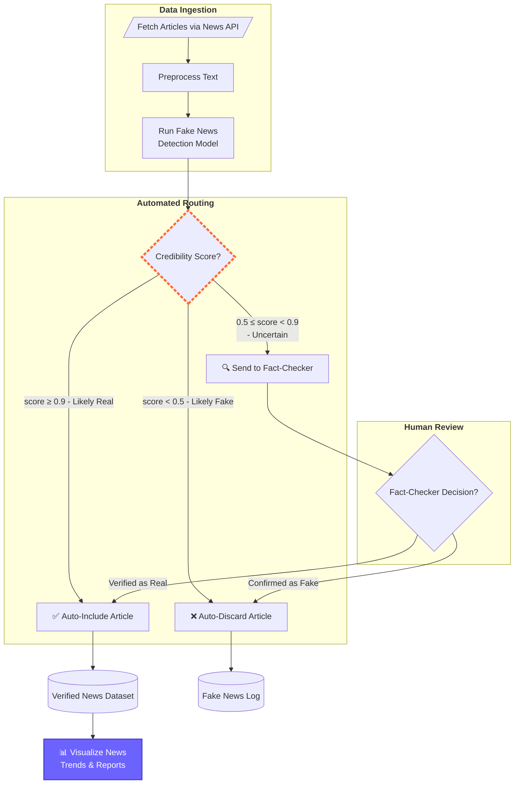
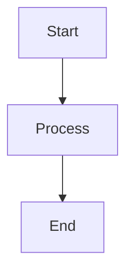

# 번역 기사

- **원본 URL:** https://medium.com/data-science-collective/why-i-stopped-using-nano-banana-for-complex-diagrams-and-switched-to-mermaid-b278db249d21
- **번역 일시:** 2026-03-26 16:09:45

---

# 복잡한 다이어그램에 이미지 생성 모델 대신 Mermaid를 사용하는 이유

---

미디엄(Medium) 데이터 과학 커뮤니티의 조언, 통찰력 및 아이디어

팔로우 중 멤버 전용 스토리

아만다 이글레시아스 모레노(Amanda Iglesias Moreno) 팔로우
8분 독서 · 2026년 3월 8일

202
3

이미지를 전체 크기로 보려면 Enter를 누르거나 클릭하세요.
복잡한 다이어그램에 이미지 생성 모델 사용을 중단한 이유 (저자 제공 이미지)

이미지 생성 모델(Image generation models)은 지난 몇 달간 극적으로 발전하여 더욱 복잡하고 사실적인 시각화를 제공하고 있습니다. 하지만 복잡하고 잘 구조화된 기술 다이어그램(technical diagrams)을 생성하는 데에는 여전히 한계가 있습니다. 바로 이 지점에서 Mermaid가 진정으로 두각을 나타냅니다.

Mermaid는 일반 텍스트 설명(plain-text descriptions)으로 다이어그램을 생성하는 도구로, 시각화를 쉽게 재현하고 편집할 수 있도록 합니다. 다이어그램을 만들 때 Mermaid 문법(syntax)을 배울 필요가 없습니다. 심지어 대규모 언어 모델(LLMs)을 사용하여 아이디어를 Mermaid 코드로 변환하고 복잡한 기술 다이어그램을 생성할 수도 있습니다.

이 글에서는 자연어(natural language)와 강력한 대규모 언어 모델(large language model)만을 사용하여 Mermaid로 복잡한 다이어그램을 만드는 방법을 보여드립니다. 데이터 과학자(data scientists)가 가장 일반적으로 사용하는 다이어그램 유형에 초점을 맞추는 동시에, 추가적인 옵션에 대해서도 간략하게 소개할 것입니다. 마지막으로, 이 다이어그램들을 주피터 노트북(Jupyter notebooks)에 통합하여 데이터 과학 워크플로(workflow)의 모든 단계를 명확하고 구조화된 방식으로 문서화하는 데 도움이 되는 방법을 보여드립니다.

다이어그램 생성 전문가가 될 준비가 되셨나요? 계속 읽어보세요!

## 다이어그램 생성에 이미지 생성 모델보다 Mermaid가 더 나은 이유

이미지 생성 모델의 주요 문제점 중 하나는 여전히 텍스트 렌더링(text rendering)입니다. 오타나 왜곡된 문자 때문에 이미지를 다시 생성해야 했던 횟수는 셀 수 없을 정도입니다(그리고 대부분의 경우, 저는 그 오류를 수정할 수 없었습니다).

Mermaid는 실제 텍스트 객체(text objects)를 사용하기 때문에 이러한 문제에 직면하지 않을 것입니다. 라벨(labels)은 정의된 대로 정확하게 생성되며, 환각 현상(hallucinations)이나 왜곡이 없습니다.

Mermaid는 자체적인 문법(syntax)을 가지고 있어 처음에는 낯설게 느껴질 수 있지만, 대규모 언어 모델(large language models)을 사용하여 쉽게 생성할 수 있습니다. 시각화를 생성하기 위해 자연어를 사용하는 대신, 다이어그램을 정의하는 Mermaid 코드를 생성하는 데 사용합니다.

이미지를 전체 크기로 보려면 Enter를 누르거나 클릭하세요.
AI 기반 시각화 생성 방법 비교 (저자 제공 이미지)

위 이미지는 기술 다이어그램을 생성하는 두 가지 가능한 워크플로(workflow)를 보여줍니다. 두 번째 워크플로는 대규모 언어 모델을 사용하여 Mermaid 코드를 생성하며, 이 코드는 예를 들어 주피터 노트북의 마크다운(Markdown) 셀에서 렌더링(rendered)될 수 있습니다. 제시된 워크플로는 Mermaid 코드를 사용하여 생성되었습니다. 보시다시피, 텍스트는 완벽하게 렌더링되었고, 연결(connections)도 우리가 원하는 대로 정확하게 설정되었습니다.

Mermaid로 만들 수 있는 다이어그램 유형은 많지만, 다음 섹션에서는 데이터 과학에서 가장 유용한 다이어그램 중 하나인 순서도(flowcharts)에 집중할 것입니다.

## Mermaid로 순서도 만들기

데이터 과학에서 프로세스(processes)와 알고리즘(algorithms)은 단순한 순서를 따르는 경우가 드뭅니다. 결정을 내려야 하는 많은 단계가 있으며, 전체적인 논리(logic)를 시각화하고 전달할 수 있다는 것은 매우 중요합니다. 바로 이 지점에서 순서도가 유용하게 활용됩니다.

아래 예시는 뉴스 애그리게이터(news aggregator) 순서도를 보여줍니다. 뉴스 기사는 API를 사용하여 스크랩(scraped)되고, 예측 모델(prediction model)이 기사의 유효성을 평가합니다. 명백히 가짜인 뉴스는 데이터셋(dataset)에서 제거되는 반면, 높은 점수를 받은 뉴스는 자동으로 포함됩니다. 중간 점수를 받은 뉴스는 수동으로 확인됩니다(인간 개입 접근 방식(human-in-the-loop approach)).

Mermaid로 작성된 순서도 (저자 제공 이미지)

이 다이어그램을 비전문가(non-technical audience)에게 제시하면 전체 워크플로를 빠르게 이해할 수 있습니다. 하지만 이 다이어그램들은 주주(shareholders)들과 소통할 때뿐만 아니라, 프로세스의 모든 단계를 명확하게 기록하기 위한 기술 문서(technical documentation)에도 매우 유용합니다.

짐작하시겠지만, 이미지 생성 모델을 사용하여 이러한 다이어그램을 만드는 것은 노드(nodes)와 연결(connections)의 수가 증가함에 따라 상당히 어렵습니다. 하지만 Mermaid를 사용하면 노드와 그 사이의 연결을 명확하게 정의할 수 있습니다.

다이어그램을 생성하기 위해 Mermaid 문법을 배울 필요는 없으므로, 문법에 대해 깊이 파고들지는 않겠습니다. 하지만 기본적인 사항들을 간략히 살펴보겠습니다.

다음 코드는 위 다이어그램을 생성하는 데 사용된 코드입니다.



Mermaid에서 순서도를 만드는 데에는 세 가지 주요 요소가 있습니다. 첫째, 다이어그램의 유형과 방향을 선언해야 합니다. 위 예시에서는 상하 방향(top-down direction, TD)의 순서도(flowchart)를 정의했습니다.

다음으로, 노드(nodes)와 연결(connections)을 정의해야 합니다. 각 노드에는 ID와 라벨(내부에 표시될 텍스트)이 필요합니다. 라벨을 감싸는 방식에 따라 다른 유형의 노드가 생성됩니다. 예를 들어, 중괄호 { }는 결정 노드(decision node)를 생성하고, 대괄호 뒤에 괄호 [( )]가 오는 형태는 데이터베이스 노드(database node)를 만듭니다.

연결에는 실선 화살표(solid arrow)를 사용했지만, 만들 수 있는 다른 많은 화살표 스타일(arrow styles)이 있습니다.

또한, 노드 색상 변경이나 특정 노드의 테두리 강조 표시와 같이 시각화를 사용자 정의(customize)하는 데 사용할 수 있는 많은 스타일링 옵션(styling options)이 있습니다. 제가 가장 좋아하는 기능 중 하나는 관련 노드를 그룹화하기 위한 서브그래프(subgraphs)를 생성하는 기능입니다.

아래 다이어그램은 이전 다이어그램과 동일하지만 이러한 사용자 정의가 추가되었습니다. 워크플로의 다양한 단계를 강조하기 위해 세 개의 서브그래프를 생성했습니다. 또한, 최종 노드의 색상을 수정하고 다른 테두리 스타일을 사용하여 결정 노드를 강조했습니다.



Mermaid로 사용자 정의된 순서도 (저자 제공 이미지)

시각화의 모든 사용자 정의 가능성을 알아보려면 Mermaid 문서(documentation)를 살펴보는 것을 권장합니다.

데이터 과학자로서 저는 종종 Mermaid를 사용하여 순서도를 만듭니다. 하지만 다른 많은 유형의 시각화도 가능합니다. 다음 섹션에서 이들을 살펴보겠습니다.

## Mermaid로 만들 수 있는 다른 차트

Mermaid를 사용하면 다양한 시각화를 생성할 수 있지만, 이 섹션에서는 데이터 과학 분야에서 더 유용하다고 생각하는 것들에 초점을 맞출 것입니다.

### 개체 관계 다이어그램(Entity Relationship Diagrams)

데이터 과학자나 데이터 분석가(data analyst)라면 데이터베이스(databases) 작업을 해보셨을 것입니다. 프로젝트 규모가 커짐에 따라 데이터베이스는 더욱 복잡해지는 경향이 있으며, 많은 테이블(tables)과 관계(relationships)를 포함합니다.

이러한 테이블들이 어떻게 상호작용하는지 이해하는 것은 특히 매우 큰 데이터베이스의 경우 어렵습니다. 바로 이 지점에서 개체 관계 다이어그램(Entity Relationship Diagrams, ERD)이 진정으로 두각을 나타냅니다. ERD는 데이터베이스의 구조를 시각적으로 표현하며, 개체(entities, 테이블), 그 속성(attributes), 그리고 개체들이 어떻게 연결되는지(관계)를 보여줍니다.

이미지를 전체 크기로 보려면 Enter를 누르거나 클릭하세요.
Mermaid의 개체 관계 다이어그램 예시 (저자 제공 이미지)

### 시퀀스 다이어그램(Sequence Diagrams)

에이전틱 AI(agentic AI)의 새로운 폭발적인 성장에 따라, 시퀀스 다이어그램(Sequence Diagrams)은 에이전트(agents)들이 어떻게 통신하고, 결정을 내리고, 작업을 반복하며, 외부 도구와 상호작용하는지를 시각화하는 필수적인 도구가 되었습니다.

이미지를 전체 크기로 보려면 Enter를 누르거나 클릭하세요.
Mermaid의 에이전트 오케스트레이션 예시 (저자 제공 이미지)

이것들은 제가 자주 사용하는 몇 가지 예시에 불과합니다. Mermaid로 만들 수 있는 다양한 다이어그램에 대해 더 자세히 알고 싶다면 문서를 살펴보세요. 이 도구가 지원하는 다이어그램 유형의 다양성에 놀랄 수도 있습니다.

## 주피터 노트북에 Mermaid 다이어그램 통합하기

Mermaid 다이어그램을 주피터 노트북(Jupyter Notebooks)에 통합하는 것은 작업을 문서화하는 효과적인 방법입니다. 비주얼 스튜디오 코드(Visual Studio Code)를 사용하고 있다면, Mermaid 마크다운 문법 강조(Mermaid Markdown Syntax Highlighting) 확장 프로그램(extension)을 설치할 수 있습니다(다른 개발 환경(development environment)을 사용하는 경우 Mermaid 활성화 과정이 다를 수 있습니다).

이 확장 프로그램은 다음 코드(code)로 다이어그램을 감싸는 것만으로 노트북의 마크다운 셀(markdown cells)에서 Mermaid 다이어그램을 렌더링할 수 있게 해줍니다:

````markdown

````

그러면 노트북을 HTML로 내보내더라도 모든 다이어그램이 워크플로에 통합될 것입니다.

이미지를 전체 크기로 보려면 Enter를 누르거나 클릭하세요.
Mermaid 다이어그램이 포함된 HTML 파일 (저자 제공 이미지)

자, 이제 모든 다이어그램이 적절하게 렌더링되고 워크플로 문서에 통합될 것입니다.

## 요약

이미지 생성 모델로 복잡한 기술 다이어그램을 만드는 것은 어려운 과정일 수 있습니다. 오타, 왜곡된 문자, 잘못된 다이어그램 연결 및 기타 여러 문제로 인해 이미지를 다시 생성해야 하는 반복적인(iterative) 과정이 되는 경우가 많습니다.

이 글에서는 복잡한 기술 다이어그램을 구축하기 위한 코드 기반 대안인 Mermaid를 살펴보았습니다. Mermaid는 자체적인 문법을 가지고 있으며, 대규모 언어 모델을 사용하여 쉽게 생성할 수 있습니다. 우리는 Claude Sonnet 4.6을 사용했지만, 유사한 결과를 생성하는 강력한 LLM이라면 어떤 것이든 사용할 수 있습니다.

Mermaid를 사용하면 다이어그램 텍스트와 연결이 정의된 대로 정확하게 생성되며, 환각 현상이나 왜곡이 없습니다. 이는 이미지 생성 모델이 모든 텍스트와 관계를 생성하는 데 종종 실패하는 복잡한 다이어그램을 만드는 데 강력한 대안이 됩니다. 또한, Mermaid 다이어그램은 주피터 노트북에 쉽게 통합되어 워크플로와 프로세스를 적절하게 문서화할 수 있습니다.

읽어주셔서 감사합니다!

이와 같은 더 많은 콘텐츠를 원하시면, 제 인스타그램 [@ai_data_con_amanda](https://www.instagram.com/ai_data_con_amanda)를 확인해 보세요. 그곳에서 데이터 과학 및 AI에 대한 시각 자료와 통찰력을 공유합니다. 📊🤖

또한 제 뉴스레터를 구독하여 최신 소식을 받아볼 수 있습니다. 제 정기 콘텐츠에는 데이터 과학, 데이터 시각화, 지리공간 데이터, 그리고 인공지능 분야의 기사가 포함됩니다:

[AI 에이전트가 신뢰할 수 있다고 생각하시나요? — Pydantic이 AI 에이전트의 구조와 안전을 지키는 방법](https://medium.com/data-science-collective/think-your-ai-agent-is-reliable-how-pydantic-keeps-ai-agents-structured-and-safe-355fb5ce2b4c)
환각 현상을 제거하고, 스키마(schemas)를 적용하며, 신뢰할 수 있는 AI 에이전트를 구축하는 방법을 배우세요.

[NotebookLM이 대대적인 업그레이드를 받았습니다 — NotebookLM의 최신 기능 및 업데이트 탐색](https://medium.com/data-science-collective/notebooklm-just-got-a-serious-upgrade-exploring-notebooklms-newest-features-and-updates-c782782e3c0e)
무엇이 새로워졌고 왜 중요한가

[파이썬 스크립트로 주피터 노트북을 실행하고 HTML 보고서를 생성하는 방법](https://medium.com/data-science-collective/how-to-run-jupyter-notebooks-and-generate-html-reports-with-python-scripts-61b4020a59a7)
파이썬을 사용하여 주피터 노트북 실행 및 보고서 생성을 자동화하는 단계별 가이드

[여러분이 만들 수 있다는 것을 몰랐던 플로틀리(Plotly)의 놀라운 5가지 시각화](https://medium.com/data-science-collective/5-amazing-plotly-visualizations-you-didnt-know-you-could-create-3759a22f7162)
고급 데이터 시각화를 위한 와플 차트(Waffle Charts), 캘린더 플롯(Calendar Plots), 육각형 지도(Hexagon Maps), 의회 다이어그램(Parliament Diagrams), 범프 차트(Bump Charts)를 탐색하세요…

**아만다 이글레시아스(Amanda Iglesias)**
데이터 과학 프로그래밍 기술 AI 데이터 시각화

데이터 과학 콜렉티브(Data Science Collective)에 게시됨
90만 4천 팔로워 · 최종 발행 5시간 전

미디엄 데이터 과학 커뮤니티의 조언, 통찰력, 아이디어

작성자: 아만다 이글레시아스 모레노(Amanda Iglesias Moreno)
3.8천 팔로워 · 119 팔로우 중

Statista 소속 선임 데이터 과학자 | 데이터 시각화, 지리 데이터, AI 및 머신러닝 전문 | 인스타그램: [https://www.instagram.com/ai_data_con_amanda](https://www.instagram.com/ai_data_con_amanda)