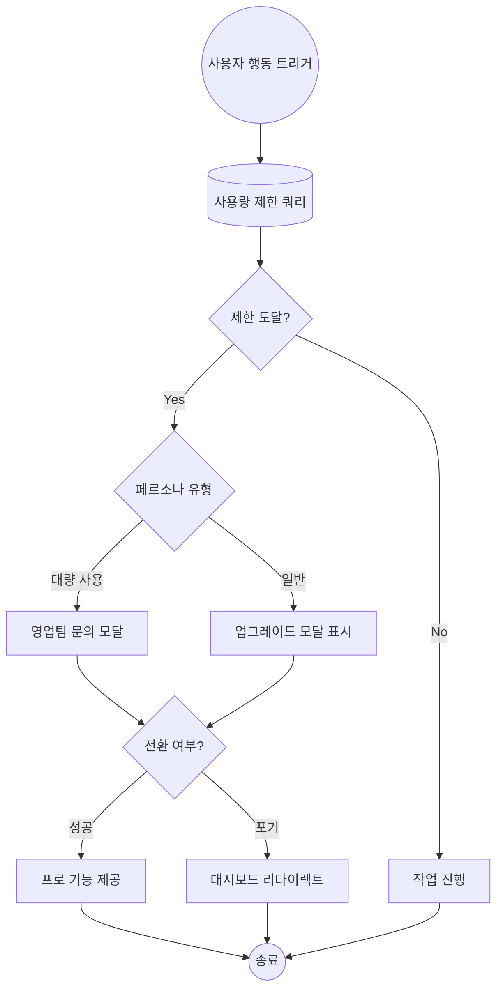

# 번역 기사

- **원본 URL:** https://itnext.io/stop-using-ugly-charts-how-to-build-pro-level-diagrams-with-mermaid-js-and-nano-banana-2-f2c96d914350
- **번역 일시:** 2026-04-02 07:26:42

---

# Stop Using Ugly Charts: How to Build Pro-Level Diagrams with Mermaid.js and Nano Banana 2 🚀

며칠 전 Google에서 출시한 Nano Banana 2는 로직을 시각화하는 방식에 있어 혁명적인 변화를 가져왔습니다. 아키텍처 다이어그램을 자주 그리는 개발자로서 저는 이 도구의 진정한 '킬러 앱(killer app)'을 발견했습니다. 바로 다이어그램 제작입니다.

명확한 플로우차트는 그 어떤 설명보다 효과적이지만, 이를 발표용으로 다듬는 과정은 보통 수동적인 드래그 앤 드롭 작업으로 점철된 고통스러운 시간입니다. 

저의 새로운 워크플로우는 두 단계로 이루어집니다. 먼저 **Gemini**를 사용해 견고한 **Mermaid.js** 다이어그램을 생성 및 검증하고, 이 구조적 '진실의 근원(source of truth)'을 **Nano Banana 2**에 입력하여 전문가 수준의 고충실도(high-fidelity) 결과물을 렌더링하는 것입니다. 이는 결정론적 로직(deterministic logic)과 AI 기반 미학의 완벽한 결합입니다.

### Mermaid.js란 무엇인가?

Mermaid.js는 마크다운(Markdown) 기반의 텍스트 정의를 동적 다이어그램으로 렌더링하는 JavaScript 도구입니다. 마우스와 씨름하는 대신 코드를 작성합니다. 효율적이며 버전 관리(version-controllable)가 가능합니다. 텍스트-투-다이어그램(text-to-diagram) 방식을 사용하기 때문에 리포지토리의 코드 바로 옆에 문서를 보관할 수 있습니다.

Mermaid.js를 중간 단계로 사용하는 이유는 **검증(Validation)** 때문입니다. Mermaid.js는 결정론적입니다. 로직을 엄격하게 정의하도록 강제합니다. 구조를 먼저 검증함으로써 AI가 디자인적 창의성을 발휘하기 전에 다이어그램의 근본적인 '진실'이 정확한지 확인할 수 있습니다. 또한 이미지 생성기의 구조적 설계도 역할을 하여, AI가 중요한 결정 분기를 생략하는 '환각(hallucination)' 리스크를 줄여줍니다.

### 실전 예시: SaaS 업그레이드 워크플로우

사용자에게 유료 플랜 결제를 유도하는 워크플로우를 설계해 보겠습니다. 이 로직은 정교해야 합니다. 단순히 결제를 요청하는 것이 아니라 사용자의 구체적인 행동에 따라 유도해야 하기 때문입니다.

**로직 분석:**
1. **트리거(Trigger):** 사용자가 '팀원 초대'와 같은 제한된 기능을 실행합니다.
2. **검증 게이트(Validation Gate):** 데이터베이스 쿼리를 통해 무료 제한 도달 여부를 확인합니다.
3. **페르소나 분기(Persona Branch):** 사용자를 분류합니다. 사용량이 많은 유저는 '영업팀 문의'로, 일반 유저는 자동화된 '업그레이드 모달'로 안내합니다.
4. **결과(Resolution):** 기능 제공 또는 대시보드 리다이렉트로 종료됩니다.

이후 시스템 아키텍트의 역할을 부여한 프롬프트를 통해 다음과 같은 Mermaid 코드를 얻을 수 있습니다.

### Nano Banana 2를 활용한 최종 다이어그램 생성

이제 뼈대에 살을 붙일 차례입니다. Nano Banana 2로 옮길 때 가장 중요한 것은 스타일입니다. 프레젠테이션의 분위기에 맞는 룩을 선택해야 합니다. 

*   **스위스 모더니즘(Swiss Modernism):** 깔끔하고 권위 있는 느낌
*   **네오 멤피스(Neo-Memphis):** 대담하고 활기찬 느낌
*   **청사진(Blueprint) 또는 등축 투영법(Isometric 3D):** 기술적이고 상세한 느낌

다음과 같은 프롬프트 템플릿을 사용하여 시각적 수준을 높일 수 있습니다.

> "아래 제공된 Mermaid.js 로직을 바탕으로 알고리즘 플로우차트를 생성해줘. 프로세스는 사각형, 결정은 마름모, 데이터 저장소는 실린더 등 표준 관행을 준수하고 라벨이 있는 화살표를 사용해줘.
> 스타일: 네오 멤피스, 흰색 배경. 
> 종횡비: 16:9"

결과물은 일반적인 흑백 차트와는 비교할 수 없을 정도로 뛰어납니다. 분위기를 바꾸고 싶다면 스타일 태그만 교체하면 됩니다. (예: 손으로 그린 스케치 노트 스타일, 리소그래프 스타일 등)

### 결론

지루한 차트를 사용하는 것은 선택의 문제입니다. Nano Banana 2와 Mermaid.js를 활용하면 전문 디자인 스튜디오를 손끝에 둔 것과 같습니다. 코드 기반 로직의 정밀함과 최고 수준 일러스트레이터의 미적 감각을 결합할 수 있습니다. 이제 기본 도형에 안주하지 말고 사람들의 시선을 사로잡는 다이어그램을 만들어 보세요.